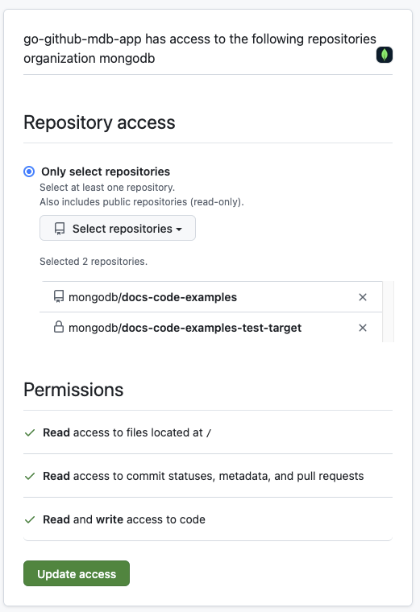

# GitHub Docs Code Example Copier

A GitHub app that listens for PR events from a source repository. Driven by a 
single `config.json` file in the source repo, the app copies files 
(currently, generated code snippets and examples) to one or more target 
repositories upon PR merge in source repo.

## Behavior

On PR merge in source repo, the app identifies changed files from the PR payload.
1. Read files from a specific path the source repo, with optional recursion (default: recursive copy)
2. Copy changed files to target repos/branches as defined in the config  (default: "main"); deletions are recorded to a deprecation file.
3. Writes can be direct commits or through PRs (optional auto-merge), with clear handling for conflicts and mergeability.

### Configuration defaults
- Strategy priority: per-config `copier_commit_strategy` > `COPIER_COMMIT_STRATEGY` env > default "direct" for testing.
- Messages: per-config `commit_message` > `DEFAULT_COMMIT_MESSAGE` env > system default ("Automated PR with updated examples").
- PR title: falls back to the resolved commit message when `pr_title` is empty.
- Conflicts:
  - Direct commits surface non-fast-forward (HTTP 422) with a clear error suggesting PR strategy.
  - PR auto-merge path polls GitHub for mergeability; if not mergeable, it leaves the PR open for manual resolution.
- Useful environment settings:
  - `COPIER_COMMIT_STRATEGY` ("direct"|"pr"), `DEFAULT_COMMIT_MESSAGE`, `DEFAULT_RECURSIVE_COPY`, `DEFAULT_PR_MERGE`.
  - Logging: `COPIER_DISABLE_CLOUD_LOGGING`, `LOG_LEVEL=debug` or `COPIER_DEBUG=true`.

## Project Structure

| Directory Name | Use Case                                                                                                                                                                                  |
|----------------|-------------------------------------------------------------------------------------------------------------------------------------------------------------------------------------------|
| `configs`      | The configuration files (.env.*) are here, as is the `environment.go` file, which creates globals for those settings. No other part of the code should read the .env files.               |
| `services`     | The handlers for the services we're interacting with: GitHub and Webhook handlers. For better organization, GitHub handlers have been separated into Auth, Upload, and Download services. |
| `types`        | All the `type StructName struct` should be here. These are the structs needs to map webhook json to objects we can work with.                                                             |

## Logic Flow

At its core, this is a simple Go web server that listens for messages and handles them
as they come in. Handling the messages means:
- Determining if it's a message we care about
- Pulling out the changed file list from the message
- Reading the config file, and if a file is in a config setting,
- Copy/replace the file at the target repo.

Basic flow:

1. Configure GitHub permissions (`services/GitHub_auth.go`)
2. Listen for PR payloads from the GitHub webhook. (`services/web_server.go`)
3. Is the PR closed and merged? If no, ignore. (`services/webhook_handler.go`)
4. Parse the payload to get the list of changed files. (`services/GitHub_download.go`)
5. Read the config file from the source repo.
6. If the path to a changed file is defined in the config file, and it is not a
   "DELETE" action, copy the file to the specified target repos. (`services/GitHub_upload.go`)
7. If the path to a changed file is defined in the config file, and it *is* a "DELETE"
   action, add the deleted file's name and path to the `deprecated_examples.json` file.
   (`services/GitHub_download.go`)
8. Sit idle until the next payload arrives. Rinse and repeat.

## Install the App on a Target Repo
To install the app on a new target repository:
1. [Give the App repo access](# Give the app repo access)
2. [Install the App in the new source repo](# Install the App on a new Source Repo)

### Give the app repo access
1. Go to the [App's Configuration page](https://github.com/apps/docs-examples-copier/installations/62138132).
   You'll need to authorize your GitHub account first. You should then see the following screen:
   
2. In the `Select repositories` dropdown, select the new target repo. Then click
   **Update access**.
> **NOTE:** You must be a repo owner to complete the next steps. If you are not a repo owner,
you will not see the `Select repositories` dropdown, and you will not be able
> to select the new target repository. 
> 

### Confirm the new target repository
1. In the new target repository's settings, go to the
   [GitHub Apps section](https://GitHub.com/mongodb/stitch-tutorial-todo-backend/settings/installations).
   Scroll down and confirm that `Docs Examples Copier` is installed.

## Install the App on a new Source Repo
In the source repo, do the following:
1. [Set up a webhook](# Set Up A Webhook)
2. [Update the .env file](# Update the env file)
3. [Add config.json and deprecated_examples.json files](# Add config.json and deprecated_examples.json files)
4. [Configure Permissions for the Web App](# Configure Permissions for the Web App)

### Set Up A Webhook
Go to the source repo's
[webhooks settings page](https://GitHub.com/mongodb/docs-code-examples/settings/hooks/).
- Add the new `Payload URL`.
- Set the `Content Type` to `application/json`
- Enable SSL Verification
- Choose `Let me select individual events`
    - Choose *only* `Pull Requests`. Do **not** choose any other "Pull Request"-related
      options!
- At the bottom of the page, make sure `Active` is checked, and then save your changes.

At this point, with PR-related activity, the payload will be sent to the app.
The app ignores all PR activity except for when a PR is closed and merged.

### Update the env file
The .env file specifies settings for the source repo.

Copy the `.env.example` and update the main values for your repo:

```dotenv
GITHUB_APP_ID="GitHub App ID (numeric) for your GitHub App"
# Optional (not required for JWT auth):
# GITHUB_APP_CLIENT_ID="OAuth client ID of your GitHub App (starts with Iv)"
INSTALLATION_ID="When you install the app, you get an installation ID, something like 73438188"

GOOGLE_CLOUD_PROJECT_ID="The Google Cloud Project (GCP) ID"
COPIER_LOG_NAME="The name of the log in Google Cloud Logging"

REPO_NAME="The name of the *source* repo"
REPO_OWNER="The owner of the *source* repo"
REF="The *source* branch to monitor for changes - e.g. 'main' or 'master'"

COMMITER_EMAIL="The email you want to appear as the committer of the changes, e.g. 'foo@example.com'"
COMMITER_NAME="The name you want to appear as the committer of the changes, e.g. 'GitHub Copier App'"

PORT="leave empty for the default server port, or specify a port, like 8080"
WEBSERVER_PATH="/events"

DEPRECATION_FILE="The path to the deprecation file, e.g. deprecated_examples.json"
CONFIG_FILE="The path to the config file, e.g. config.json"
```
Update any of the optional settings in the `.env.example` file as needed.

### Add config and deprecation json files

Create the config file to hold config settings and an empty `.json` file to hold deprecated file paths.
See the [config.example.json](configs/config.example.json) for reference.
```json
[
  {
    "source_directory": "path/to/source/directory",
    "target_repo": "example-repo",
    "target_branch": "main",
    "target_directory": "path/to/target/directory",
    "recursive_copy": true,
    "copier_commit_strategy": "Optional commit strategy for this config entry ('pr' or 'direct')",
    "pr_title": "Optional PR title for this config entry",
    "commit_message": "Optional commit message for this config entry",
    "merge_without_review": false
  }
]
```

Leave the deprecation file an empty array:
```json
[
]
```

### Configure Permissions for the Web App
To configure the app in the source repo, go to the repo's list of web apps.
You should see the Docs Examples Copier listed:


## Hosting
This app is hosted in a Google Cloud App Engine, in the organization owned by MongoDB.
The PEM file needed for GitHub Authentication is stored as a secret in the Google Secrets Manager.
For testing locally, you will need to download the auth file from gcloud and store it locally.
See the [Google Cloud documentation](https://cloud.google.com/docs/authentication/application-default-credentials#GAC)
for more information.

### Change Where the App is Hosted
If you deploy this app to a new host/server, you will need to create a new webhook
in the source repo. See [Set Up A Webhook](# Set Up A Webhook)


## How to Modify and Test
To make changes to this app:
1. Clone this repo.
2. Make the necessary changes outlined earlier.
3. Change the `.env.test` to match your environment needs, or create a new `.env` file and reference
   it in the next step.
4. Test by running `go run app.go -env ./configs/.env.test`

5. Note: you **do not need to change the GitHub app installation**. Why? I think
because it is entirely self-contained within this Go app.

### Testing notes
As of this writing, the source repo (https://GitHub.com/mongodb/docs-code-examples) has
two webhooks configured: one points to the production version of this application, and
the other points to a [smee.io proxy](https://smee.io/5Zchxoa1xH7WfYo).

#### What is smee.io?
Smee.io provides a simple way to point a public endpoint to localhost on your computer.
It requires the smee cli, which is very lightweight. You run the proxy with a single
command (`smee -u https://smee.io/5Zchxoa1xH7WfYo`) and any webhooks that go to that
url will be directed to http://localhost:3000/. This is entirely optional, and there are
probably other solutions for testing. I just found this dead simple.

**Note** The current production deployment looks for messages on the default
port and the `/events` route, while your testing hooks (like smee) might only send
messages on a specific port and/or the default path. This is why you can change the
port and route in the `.env.*` files.

## Future Work

- ~~BUG/SECURITY: Move .pem to google secret.~~
- ~~Where do we view the log for the app when it hits a snag?~~
  Fixed in 112c8953cbb54d3743b25744fe01f6649f783faa. Added Google
  Logging and centralized logging service for terminal logging.
- ~~Currently each write is a separate commit. Bad. Fix.~~
  Fixed in f91ccfce74edff56eb305068357a069d12a2020f
- Slack integrations:
    - notifies a channel when the
      `deprecated_examples.json` file changes, so writers can find those deprecated examples
      in the docs and update/remove them accordingly. See this
      [Slack API page](https://api.slack.com/messaging/webhooks).
    - posts log updates (e.g. PR created and ready for review)
- Automate further with hook to Audit DB to get doc files with literal includes & iocode blocks (???)
- ~~Mock tests~~ 