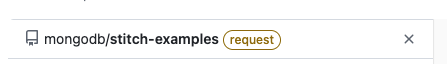
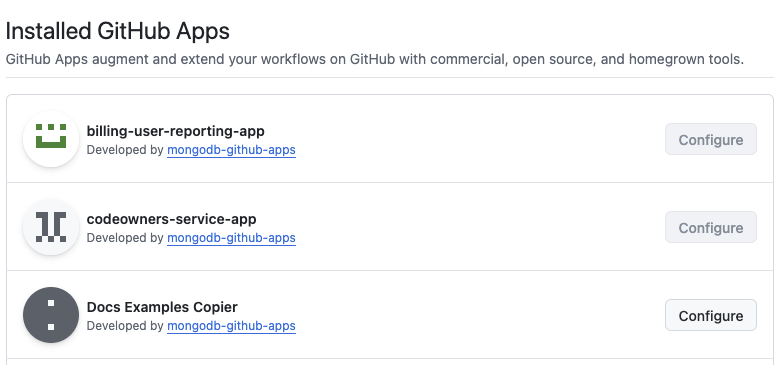

# GitHub Docs Code Example Copier

A GitHub app that copies generated code snippets and examples from a source repository
(currently https://github.com/mongodb/docs-code-examples)
to multiple target repositories. Driven by a single `config.json` file in the source repo,
it can copy and modify:

- All files from a folder to a specific path in a single repo.
- All files from a folder to different paths in a single repo or different repos.
- Files to different branches on target repos.
- Ignore all files in folders not specified in the `config.json` file.

If you _remove_ a code snippet from the source, the app will detect this (assuming its
path is in the config file) and will add it to the `deprecated_examples.json` file. 
It will *not* delete the file(s) from target repos, so links in our docs will not be 
broken.

## Install the App on a Target Repo
There are two primary steps for installing the app on a new target repository.

### Choose a new target repository
Go to the [App's Repository Access page](https://github.com/apps/go-github-mdb-app/installations/62138132).
You'll see the following screen:


In the `Select repositories` dropdown, select the new target repo, and then click 
`Update access`. 
**NOTE:** if you are not an owner of the target repository, one of the owners will need 
to complete the next steps. You will know this if the repository you selected has a 
`request` tag next to it:



### Confirm the new target repository
In the new repository's settings, go to the 
[GitHub Apps section](https://github.com/mongodb/stitch-tutorial-todo-backend/settings/installations).
Scroll down and confirm that `go-github-mdb-app` is installed.


## Install the App on a new Source Repo
Start with the steps above for configuring a target repo. Then, in the source repo, 
do the following:

### Set Up A Webhook

Go to the source repo's 
[webhooks settings page](https://github.com/mongodb/docs-code-examples/settings/hooks/).
- Add the new `Payload URL`.
- Set the `Content Type` to `application/json`
- Enable SSL Verification
- Choose `Let me select individual events`
  - Choose *only* `Pull Requests`. Do **not** choose any other "Pull Request"-related
    options! 
- At the bottom of the page, make sure `Active` is checked, and then save your changes.

At this point, with PR-related activity, the payload will be sent to the app. 
The app ignores all PR activity except for when a PR is closed and merged.

### Update the .env file
The .env file specifies settings for the source repo. Be sure to update these:
```
REPO_NAME="docs-code-examples"
REPO_OWNER="mongodb"
```

### Add config.json and deprecated_examples.json files
See the existing source repo for examples.

Config.json:
```
[
    {
        "source_directory" : "generated-examples/go",
        "target_repo" : "docs-code-examples-test-target",
        "target_branch" : "main",
        "target_directory" : "go"
    }
]
```

deprecated_examples.json should just be an empty array:
```
[
]
```

### Configure Permissions for the Web App
To run the web app on a new repo, you have to go to the web app's 
[configuration page](https://github.com/apps/docs-examples-copier/installations/62138132)
and select the repo from the list of available repos. Save the channges, and then in the 
new repo's list of web apps, you should see it listed:



## Change Where the App is Hosted
If you deploy this app to a new host/server, you will need to create a new webhook 
in the source repo. See [Set Up A Webhook](#Set Up A Webhook)


## How to Modify and Test

To make changes to this app:
1. Clone this repo.
2. Make the changes. See the next section to understand the project structure.
3. Change the .env.test to match your environment needs, or create a new .env file and reference 
   it in the next step.
4. Test by running `go run app.go -env ./configs/.env.test`
5. Interestingly, you **do not need to change the GitHub app installation**. Why? I think 
   because it is entirely self-contained within this Go app. 

### Testing notes
As of this writing, the source repo (https://github.com/mongodb/docs-code-examples) has 
two webhooks configured: one points to the production version of this application, and 
the other points to a [smee.io proxy](https://smee.io/5Zchxoa1xH7WfYo). 

#### What is smee.io?
Smee.io provides a simple way to point a public endpoint to localhost on your computer. 
It requires the smee cli, which is very lightweight. You run the proxy with a single 
command (`smee -u https://smee.io/5Zchxoa1xH7WfYo`) and any webhooks that go to that 
url will be directed to http://localhost:3000/. This is entirely optional, and there are 
probably other solutions for testing. I just found this dead simple.

**Note** The current production deployment looks for messages on the default 
port and the `/events` route, while your testing hooks (like smee) might only send 
messages on a specific port and/or the default path. This is why you can change the 
port and route in the `.env.*` files.

## Under the Hood

At its core, this is a simple Go web server that listens for messages and handles them 
as they come in. Handling the messages means:
- Determining if it's a message we care about
- Pulling out the changed file list from the message
- Reading the config file, and if a file is in a config setting,
- Copy/replace the file at the target repo.

### About The Project Structure

| Directory Name | Use Case                                                                                                                                                                                  |
|----------------|-------------------------------------------------------------------------------------------------------------------------------------------------------------------------------------------|
| `configs`      | The configuration files (.env.*) are here, as is the `envirnoment.go` file, which creates globals for those settings. No other part of the code should read the .env files.               |
| `services`     | The handlers for the services we're interacting with: GitHub and Webhook handlers. For better organization, GitHub handlers have been separated into Auth, Upload, and Download services. |
| `types`        | All the `type StructName struct` should be here. These are the structs needs to map webhook json to objects we can work with.                                                             |

## Logic Flow

1. Configure github permissions (`services/github_auth.go`)
2. Listen for PR payloads from the GitHub webhook. (`services/web_server.go`)
3. Is the PR closed and merged? If no, ignore. (`services/webhook_handler.go`)
4. Parse the payload to get the list of changed files. (`services/github_download.go`)
5. Read the config file from the source repo.
6. If the path to a changed file is defined in the config file, and it is not a 
   "DELETE" action, copy the file to the specified target repo(s). (`services/github_upload.go`)
7. If the path to a changed file is defined in the config file, and it *is* a "DELETE" 
   action, add the deleted file's name and path to the `deprecated_examples.json` file.
   (`services/github_download.go`)
8. Sit idle until the next payload arrives. Rinse and repeat.

## Future Work

- ~~Where do we view the log for the app when it hits a snag?~~
     Fixed in 112c8953cbb54d3743b25744fe01f6649f783faa. Added Google 
     Logging and centralized logging service for terminal logging.
- ~~Currently each write is a separate commit. Bad. Fix.~~
     Fixed in f91ccfce74edff56eb305068357a069d12a2020f
- It would be helpful to have a Slack integration that notifies a channel when the
  `deprecated_examples.json` file changes, so writers can find those deprecated examples 
  in the docs and update/remove them accordingly. See this 
  [Slack API page](https://api.slack.com/messaging/webhooks).
- Automate further with hook to Audit DB to get doc files with literal includes & iocode blocks
- Mock tests